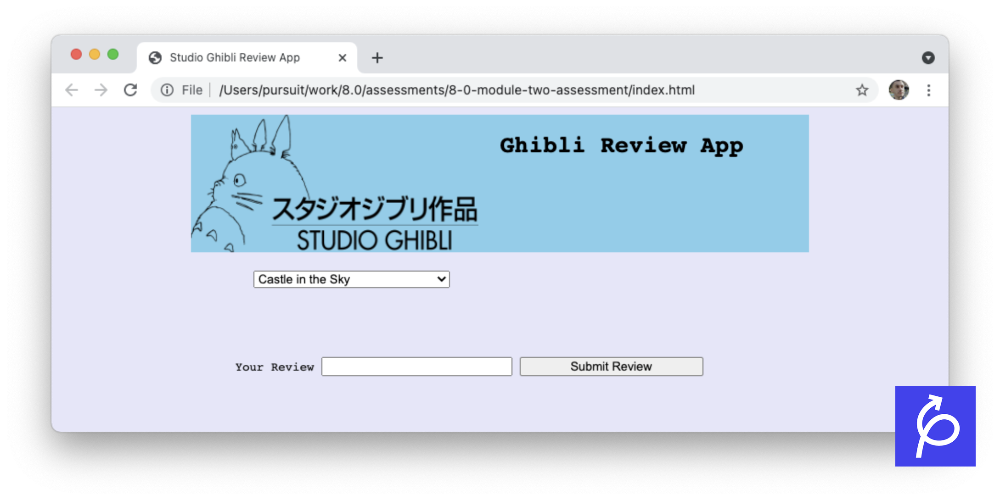
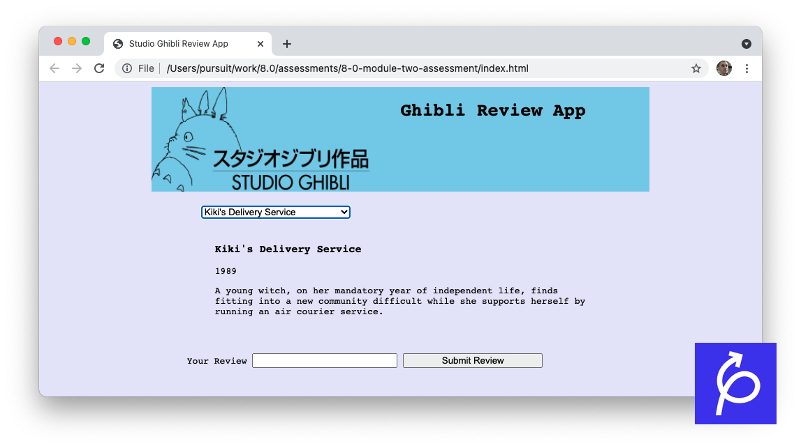
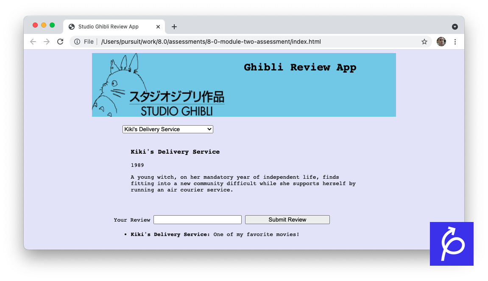
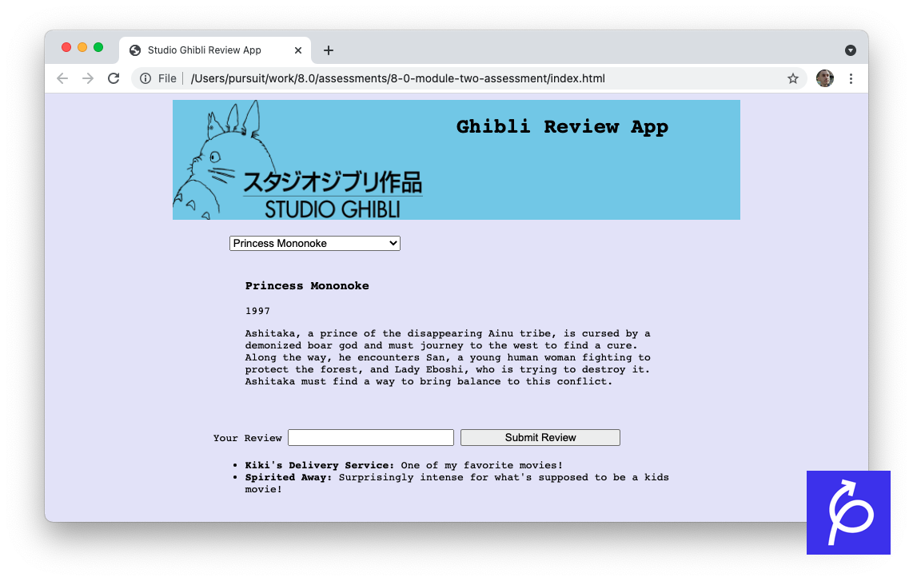

# Module Two Assessment

This challenge is designed to assess the HTML, CSS, and JavaScript skills you have gained so far.

## Assessment Setup

### Getting started

1. Fork and clone this repository.

1. Navigate to the cloned repository's directory on your command line. Then, run the following command:

   ```
   npm install
   ```

   This will install the libraries needed to run the tests.

1. Open up the repository in VSCode. Follow the instructions below to complete the Lab.

### Tests

To run the tests, you can run the following command from the command line. You will need to be in the root directory of your local directory.

```
npm test
```

This will open the Cypress testing window, where you can click to run an individual suite of tests or all of the tests at once.

## Submitting

To submit the assessment, you should do the following:

- [ ] Create a pull request against the original repository.
- In your pull request description, add screenshots of the following:
  - [ ] Your landing page, when a user first arrives.
  - [ ] Your landing page, after choosing a dropdown menu.
  - [ ] Your landing page, after submitting two reviews.
- [ ] Submit a link to your pull request on Canvas.

## Assessment Details

You will create an application using HTML, CSS, and JavaScript that accesses the Studio Ghibli API and allows users to review each movie that was made by the studio.

### The API

The API can be accessed via the link below.

- [Studio Ghibli API](https://ghibliapi.herokuapp.com)

You will only need to make one API call in your application to receive all movies. Look under "Endpoints" to find the URL you will need to access.

### Style

While there are no tests for it, your page should look similar to the following page.



While it does not need to look exactly the same, it should include the following:

- The page's background should be the color `lavender`.
- There should be a header, which takes up about 75% of the page's width.
- The header's background should be `skyblue`.
- An image of the studio's logo should be in the header and should be the same height as the header. The image can be found in the `images/` folder.
- All non-input text should be of the font `monospace`.

### Functionality

The page should fit the following requirements:

- When landing on the page, the user should see:

  - [ ] The header, which includes the studio logo and a top-level heading (i.e. `h1`), with the name of the application.
  - [ ] A dropdown that contains all Studio Ghibli movie titles, in the order they are received from the API.
  - [ ] A blank `section` after the dropdown, which has an ID of `display-info`. More information will be displayed here, later on.
  - [ ] A text input where the user, can enter review text, inside of a form and accompanied by a `submit` button.
  - [ ] An empty `ul` after the form. More information will be displayed here, later on.

- When selecting one of the options from the dropdown list, the user should see:

  - [ ] An `h3` with the movie's title appear in the `display-info` section of the page.
  - [ ] A `p` with the movie's release year.
  - [ ] A `p` with the description of the movie.

  This content should change each time the user choose a new option in the dropdown list.
  

- When the user enters their review into the text input and presses the "Submit Review" button, they should see:

  - [ ] The review, inside of an `li`, with the name of the movie in a `strong` element and the text of the review afterwards.
  - [ ] The review text should be cleared from the text input.

  

- [ ] If the user selects a different dropdown option after making the review, all of the reviews should stay where they are.
      

### Commit history

Make sure to commit often after specific features are complete. Use sensible commit messages.
